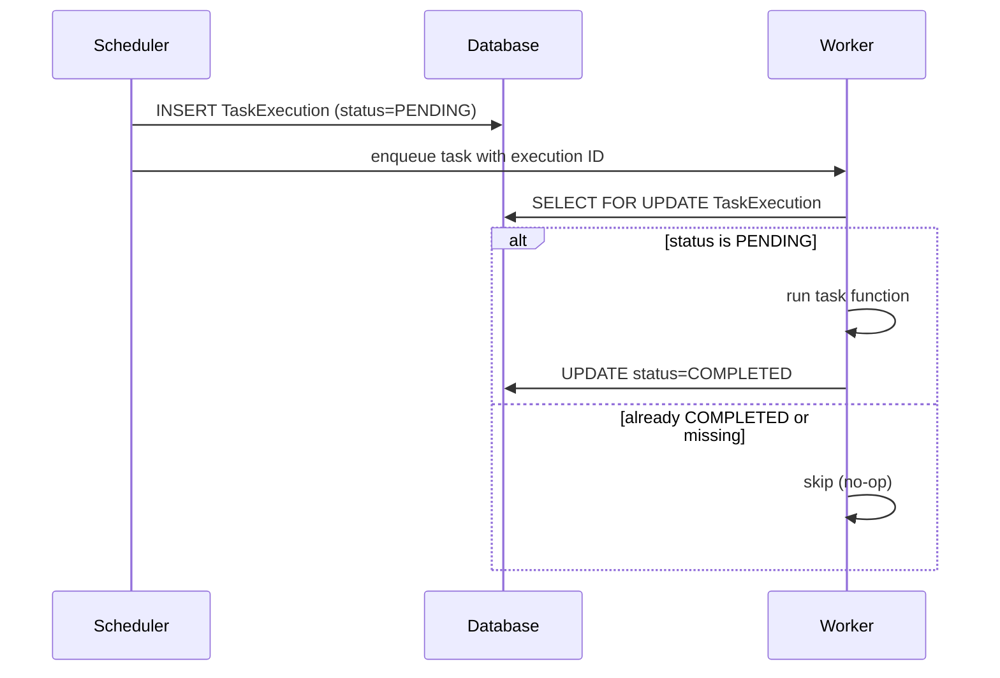

# Exactly-Once Execution

By default, the scheduler enqueues a task on each tick and trusts the worker to execute it. With non-transactional backends (e.g. Redis/RQ), there is a small window where a crash or retry could cause the same invocation to run more than once.

The `@exactly_once` decorator closes that window. It guarantees that each scheduled invocation runs **at most once**, regardless of the backend.

## How It Works

When a task is decorated with `@exactly_once`, the scheduler and worker cooperate through a `TaskExecution` row in the database:



1. **Scheduler tick** — Creates a `TaskExecution` row with `status=PENDING` and passes its ID to the task as a keyword argument.
2. **Worker picks up the task** — The `@exactly_once` wrapper locks the `TaskExecution` row with `SELECT FOR UPDATE`.
3. **If PENDING** — Runs the wrapped function and marks the row `COMPLETED`.
4. **If not PENDING** (already completed, or row missing) — Skips execution entirely.

Because the row lock is held for the duration of the function call, even if two workers receive the same task, only one will find the row in `PENDING` status.

## Usage

Apply `@exactly_once` **below** `@task()` so it wraps the raw function before django-tasks wraps it as a `Task`:

```python
from django_tasks import task
from django_periodic_tasks import scheduled_task, exactly_once


@scheduled_task(cron="0 2 * * *")
@task()
@exactly_once
def nightly_billing() -> None:
    """Charge customers — must not run twice."""
    ...
```

!!! warning "Decorator order matters"
    `@exactly_once` must be **below** `@task()`. If placed above, the scheduler won't detect the `_exactly_once` marker and will skip creating the `TaskExecution` row.

## Manual Invocation

When a task decorated with `@exactly_once` is called without the special `_periodic_tasks_execution_id` keyword argument (e.g. enqueued manually or called directly), the decorator is a no-op and the function runs normally:

```python
# These both work — exactly_once is bypassed
nightly_billing.enqueue()
nightly_billing()
```

## Stale Execution Recovery

If the scheduler creates a `TaskExecution` row but the `on_commit` callback that enqueues the task never fires (e.g. process crash, connection reset), the row becomes stale.

The scheduler automatically detects stale `PENDING` executions older than `max(60s, 2 × interval)` and re-enqueues them on the next tick. This ensures tasks are not silently lost.

## Automatic Cleanup

Completed `TaskExecution` rows are automatically deleted after 24 hours. `PENDING` rows are preserved until they are delivered or re-enqueued by the stale execution recovery process.

## When to Use It

Use `@exactly_once` when:

- The task has **side effects that must not be duplicated** (billing, sending emails, external API calls).
- You're using a **non-transactional backend** where at-least-once delivery is the default.
- You need a **database-backed audit trail** of each invocation.

You can skip it when:

- The task is **idempotent** (safe to run multiple times with the same result).
- You're using the **database backend** with transactional enqueue, which already provides strong delivery guarantees.
- **Performance** is critical and the extra `SELECT FOR UPDATE` round-trip is not acceptable.
